# Analisi Approfondita Pipeline LSTM

> Analisi del flusso completo di `LSTM.m` e tutti gli script chiamati. Nessuna modifica al codice.
> Data analisi: 2026-03-05

---

## 🗺️ Flusso della Pipeline

```mermaid
graph TD
    A["LSTM.m"] --> B["load_datas(root, zone_id)"]
    A --> C["get_training_test_validation(datas, validationDays, testDays)"]
    A --> D1["normalize_zscore(training, test, colonne) — 1° chiamata"]
    A --> D2["normalize_zscore(training, validation, colonne) — 2° chiamata"]
    A --> E1["create_lags_LSTMNN(training_norm, num_lags, predittori, target)"]
    A --> E2["create_lags_LSTMNN(test_norm, num_lags, predittori, target)"]
    A --> E3["create_lags_LSTMNN(validation_norm, num_lags, predittori, target)"]
    A --> F["trainnet(Xtraining, Ytraining, layers, 'mse', options)"]
    A --> G["get_best_indicators(info)"]
    A --> H["save_models(root, models, NET_NAME, net) — 1° chiamata"]
    A --> I["minibatchpredict + get_plot (x3)"]
    A --> J["get_indicators(predizione_test, Ytest)"]
    A --> K["save_models(root, models, NET_NAME, net) — 2° chiamata"]
```



---

## ❌ Bug Critici

### BUG 1 — Doppia normalizzazione con `params_norm` sovrascritto
**File:** [LSTM.m:50-51](../LSTM.m#L50-51)
**Gravità:** 🔴 CRITICO

```matlab
[training_norm, test_norm, params_norm] = normalize_zscore(training, test, colonne_da_normalizzare);
[training_norm, validation_norm, params_norm] = normalize_zscore(training, validation, colonne_da_normalizzare);
```

La seconda chiamata sovrascrive `training_norm` e `params_norm`. Il `test_norm` resta in workspace ma i suoi `params_norm` vengono persi. Serve un'unica chiamata che normalizzi tutti e tre i set con gli stessi parametri calcolati sul solo training.

---

### BUG 2 — `AAC_energy` duplicata in `colonne_da_normalizzare`
**File:** [LSTM.m:27-29](../LSTM.m#L27-29)
**Gravità:** 🔴 CRITICO

```matlab
predittori = {'AAC_energy','precipprob','temp','windspeed', 'holiday_indicator'};
target = 'AAC_energy';
colonne_da_normalizzare = [predittori, target]; % AAC_energy appare DUE VOLTE
```

`AAC_energy` è sia in `predittori` che in `target`, quindi compare due volte in `colonne_da_normalizzare`. Non causa errore MATLAB ma è ridondante.

---

### BUG 3 — `get_plot` introduce uno sfasamento temporale artificiale
**File:** [get_plot.m:17-21](../Scripts/get_plot.m#L17-21)
**Gravità:** 🟡 MEDIO

```matlab
time_vector_input = time_vector(1:end-1);
Y_real_aligned = Y_real(1:end-1);
Y_pred_aligned = Y_pred(2:end);
```

Il `time_vector` passato è già il timestamp del target di ogni sequenza (correttamente allineato da `create_lags_LSTMNN`). Questo riallineamento confronta Y_real(t) con Y_pred(t+1), rendendo il grafico errato.

---

### BUG 4 — `get_indicators` calcola metriche su dati NORMALIZZATI
**File:** [get_indicators.m:4-5](../Scripts/get_indicators.m#L4-5)
**Gravità:** 🟡 MEDIO

La de-normalizzazione è commentata: le metriche (RMSE, MAE, MAPE, R²) vengono calcolate in spazio z-score, non in kWh. I valori non sono fisicamente interpretabili.

---

### BUG 5 — `root` hardcoded
**File:** [LSTM.m:6](../LSTM.m#L6)
**Gravità:** 🟠 BASSO

```matlab
root = "C:\Users\trima\OneDrive - ...";
```

Non portabile. Fallisce su qualsiasi macchina o account diverso da `trima`.

---

### BUG 6 — `load(matFile)` finale ridondante
**File:** [LSTM.m:152](../LSTM.m#L152)
**Gravità:** 🟠 BASSO

Ridondante: i dati sono già in workspace. Può sovrascrivere `models` con la versione del file salvato.

---

## 📊 Riepilogo Bug

| # | Gravità | File | Descrizione |
|---|:---:|---|---|
| 1 | 🔴 Critico | `LSTM.m:50-51` | Doppia normalizzazione: `training_norm` e `params_norm` sovrascritti. `test_norm` con params orfani. |
| 2 | 🔴 Critico | `LSTM.m:27-29` | `AAC_energy` duplicata in `colonne_da_normalizzare`. |
| 3 | 🟡 Medio | `get_plot.m:17-21` | Sfasamento temporale artificiale nel grafico. |
| 4 | 🟡 Medio | `get_indicators.m` | Metriche su dati normalizzati (de-normalizzazione commentata). |
| 5 | 🟠 Basso | `LSTM.m:6` | `root` hardcoded per utente `trima`. |
| 6 | 🟠 Basso | `LSTM.m:152` | `load(matFile)` ridondante. |

---

*Questa documentazione è stata generata da AI — v1 (analisi iniziale, 2026-03-05)*
