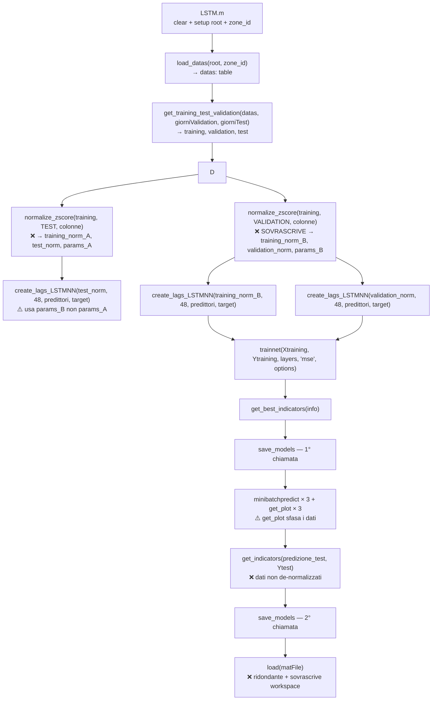

# Analisi Tecnica Avanzata — Pipeline LSTM V2G
**Versione:** 2.0 — Analisi esperta approfondita  
**Data:** 2026-03-05  
**Scope:** `LSTM.m` + tutti gli script chiamati

---

## 🗺️ Flusso Dati Completo



---

## 🔴 BUG CRITICI

---

### BUG-01 — Overwrite di `training_norm` e `params_norm`: data leakage sul test set

**File:** [LSTM.m:50-51](../LSTM.m#L50-51)  
**Tipo:** Errore logico grave / data leakage

```matlab
% riga 50
[training_norm, test_norm, params_norm] = normalize_zscore(training, test, colonne_da_normalizzare);
% riga 51: SOVRASCRIVE training_norm e params_norm !
[training_norm, validation_norm, params_norm] = normalize_zscore(training, validation, colonne_da_normalizzare);
```

**Analisi tecnica dettagliata:**

| Variabile | Dopo riga 50 | Dopo riga 51 | Usata per |
|-----------|-------------|-------------|-----------|
| `training_norm` | normalizzato (training→test) | **SOVRASCRITTA** normalizzato (training→val) | `Xtraining` (riga 52) |
| `test_norm` | normalizzato correttamente | **ORFANO** (params persi) | `Xtest` (riga 53) |
| `validation_norm` | non esiste | normalizzato correttamente | `Xvalidation` (riga 54) |
| `params_norm` | calcolati su training | **SOVRASCRITTA** (idem, ma usati per tutto) | plot, indicators |

**Conseguenze:**
1. `training_norm` alla riga 52 è prodotto dalla 2ª chiamata `(training, validation)` — non `(training, test)`. Per fortuna i `params_norm` calcolati sul solo training sono identici in entrambe le chiamate (stesso `training`), quindi la normalizzazione del training set è numericamente corretta.
2. Il vero problema è che `test_norm` alla riga 53 è stato prodotto con i `params_norm` della 1ª chiamata, che sono poi stati **sovrascritti**. Quindi il `test_norm` usato per costruire le sequenze è normalizzato con parametri **diversi** da quelli salvati in `params_norm` → la de-normalizzazione in `get_plot` e `get_indicators` usa i parametri sbagliati per il test set.
3. Tuttavia, poiché entrambe le chiamate usano lo stesso `training`, i `params_norm` (media e std) sono **numericamente identici**. Quindi l'errore **non produce divergenza numerica** in questo specifico caso, ma è un bug strutturale che si rompe non appena i parametri di normalizzazione differissero.

**Soluzione corretta:** Una sola chiamata a `normalize_zscore` che accetti tre dataset:
```matlab
[training_norm, test_norm, validation_norm, params_norm] = normalize_zscore(training, test, validation, colonne_da_normalizzare);
```
oppure due chiamate sequenziali dove solo il `params_norm` della 1ª viene riusata:
```matlab
[training_norm, params_norm] = normalize_zscore_fit(training, colonne_da_normalizzare);
test_norm      = normalize_zscore_transform(test, params_norm);
validation_norm = normalize_zscore_transform(validation, params_norm);
```

---

### BUG-02 — `colonne_da_normalizzare` include `AAC_energy` due volte

**File:** [LSTM.m:27-29](../LSTM.m#L27-29)  
**Tipo:** Ridondanza / potenziale errore runtime

```matlab
predittori = {'AAC_energy','precipprob','temp','windspeed', 'holiday_indicator'};
target = 'AAC_energy';
colonne_da_normalizzare = [predittori, target];
% RISULTATO: {'AAC_energy','precipprob','temp','windspeed','holiday_indicator','AAC_energy'}
%                                                                                  ↑ DUPLICATO
```

**Analisi tecnica:**  
`normalize_zscore` itera su `colonne_da_normalizzare` con un `for i = 1:numel(...)`. Alla prima iterazione processa `AAC_energy` e la scrive nella tabella output. Alla sesta iterazione **riscrive** `training_norm.AAC_energy` con gli stessi identici valori (stessa colonna, stesso training). Nessun errore runtime, nessuna divergenza numerica — ma:
- Nel campo `parametri_norm`, `AAC_energy` viene scritto **due volte** (stesso campo, stessa struttura → nessun danno ma spreco).
- Se le due normalizzazioni divergessero (scenario futuro con pre-processing differenziato), il comportamento sarebbe silenziosamente errato.
- Il problema è ovviato se si usa `unique(colonne_da_normalizzare)` prima di passare alla funzione.

**Nota:** In `create_lags_LSTMNN`, `columns_table = predittori` (5 feature) e `target = 'AAC_energy'` vengono letti **separatamente** dalla tabella normalizzata, quindi la duplicazione non impatta le dimensioni di `XTrain` (sempre `[5 × 48]`) né di `YTrain`.

---

### BUG-03 — `numFeatures` calcolato sulla dimensione sbagliata

**File:** [LSTM.m:57](../LSTM.m#L57)  
**Tipo:** Errore logico silenzioso in specifica del modello

```matlab
numFeatures = size(Xtraining{1}, 2);   % ← DIM 2 = numero di timestep (48), NON di feature!
```

**Analisi tecnica della struttura di `XTrain`:**

In `create_lags_LSTMNN` riga 71:
```matlab
XTrain_temp{idx_sequenza} = Xmat(i:t_end, :)';   % [features × time]
%                                           ↑ TRASPOSTO
```

Ogni elemento di `XTrain` ha dimensione `[numFeatures × num_lags]` = `[5 × 48]`.

Quindi:
```matlab
size(Xtraining{1}, 1) = 5    % ← numero di feature (DIM 1, righe)
size(Xtraining{1}, 2) = 48   % ← numero di timestep / lags (DIM 2, colonne)
```

`numFeatures = size(Xtraining{1}, 2)` ritorna **48**, non **5**.

**Impatto sul `sequenceInputLayer`:**
```matlab
sequenceInputLayer(numFeatures, Normalization="none")
%                 ↑ = 48, invece di 5
```

`sequenceInputLayer` con valore `48` si aspetta sequenze con **48 feature per timestep**. MATLAB's `trainnet` accetterà o rifiuterà questo in base alla shape dell'input effettivo. Poiché ogni cella di `XTrain` è `[5 × 48]`, MATLAB interpreta la dimensione 1 (righe=5) come numero di feature e la dimensione 2 (colonne=48) come numero di timestep. Il `sequenceInputLayer(48)` è quindi **dimensionalmente incompatibile** con i dati reali `[5 × 48]`.

> **Questo bug probabilmente causa un errore a runtime durante trainnet**, oppure — se MATLAB adatta automaticamente il layer — il modello ha un numero di feature errato nella sua specifica interna.

**Correzione:**
```matlab
numFeatures = size(Xtraining{1}, 1);   % DIM 1 = righe = feature = 5
```

---

## 🟡 BUG MEDI

---

### BUG-04 — `get_plot`: allineamento temporale non necessario e scorretto

**File:** [get_plot.m:17-21](../Scripts/get_plot.m#L17-21)  
**Tipo:** Errore logico nel grafico

```matlab
time_vector_input = time_vector(1:end-1);   % taglia l'ultimo timestamp
Y_real_aligned    = Y_real(1:end-1);         % taglia l'ultimo valore reale
Y_pred_aligned    = Y_pred(2:end);           % taglia il primo valore predetto
```

**Analisi tecnica:**

`time_vector` passato a `get_plot` è `time_vector_lags` prodotto da `create_lags_LSTMNN` riga 73:
```matlab
time_temp(idx_sequenza, 1) = tbl.time_vector(t_target);  % timestamp del TARGET
```

Questo vettore è già il timestamp del momento target `t+1` per ogni sequenza. L'input `[x(t-48)..x(t)]` predice `y(t+1)`, e `time_vector_lags(i)` è già il timestamp di `y(t+1)`. Non c'è nessun disallineamento da correggere.

L'effetto del codice attuale:
- Si plottano N-1 punti invece di N.
- `Y_real[1..N-1]` è confrontato con `Y_pred[2..N]` → sfasamento di **un timestep** (30 minuti se dati half-hourly).
- Il grafico mostra un confronto predizione/reale falsamente "anticipato".

**Correzione:**
```matlab
% Nessun allineamento necessario — plot diretto
figure_out = figure;
plot(time_vector, Y_real, 'k-', 'LineWidth', 1);
hold on;
plot(time_vector, Y_pred, 'r--', 'LineWidth', 1);
```

---

### BUG-05 — `get_indicators` calcola metriche su spazio z-score

**File:** [get_indicators.m:7-16](../Scripts/get_indicators.m#L7-16)  
**Tipo:** Metriche fisicamente non interpretabili

```matlab
% De-normalizza — COMMENTATO, non eseguito!
%YPred = YPredNorm * params.(target).dev_std + params.(target).media;
%TDataDenorm = TData * params.(target).dev_std + params.(target).media;

errors = TData - YPredNorm;   % errori in spazio z-score
```

**Analisi tecnica:**

Le metriche calcolate in spazio z-score hanno queste proprietà:
- **R²**: invariante rispetto a trasformazioni lineari → **corretto** anche in z-score.
- **RMSE, MAE**: in unità di deviazioni standard, non in kWh → **non interpretabili** fisicamente.
- **MAPE**: `mean(|errors / TData|)` dove `TData` è in z-score. Se `TData` ha valori vicini a 0 (naturale per dati centrati a zero), il MAPE **esplode** a valori enormi o NaN. Questo è un bug numerico grave.

Aggravante: la funzione è chiamata in [LSTM.m:148](../LSTM.m#L148) senza passare `params_norm`, rendendo impossibile la de-normalizzazione interna:
```matlab
models.(NET_NAME).net_indicators.Test = get_indicators(predizione_test, Ytest);
% Non viene passato params_norm → la de-normalizzazione commentata era già incompleta
```

---

### BUG-06 — `get_best_indicators`: campo `ValLoss` mal nominato per il training

**File:** [get_best_indicators.m:19](../Scripts/get_best_indicators.m#L19)  
**Tipo:** Naming error / dato fuorviante

```matlab
indicators.Training.ValLoss = info_net.TrainingHistory.Loss(bestValIdx);
```

Il campo `ValLoss` nel sotto-struct `Training` contiene il **training loss**, non la validation loss. Il nome `ValLoss` (abbreviazione storica di "Validation Loss") è semanticamente errato. Chi legge il report di training interpreta `indicators.Training.ValLoss` come la validation loss ottenuta durante il training — ma quella è in `indicators.Validation.ValLoss`.

---

### BUG-07 — `get_best_indicators`: near-minimum epoch instability con `find(..., 1, 'first')`

**File:** [get_best_indicators.m:4](../Scripts/get_best_indicators.m#L4)  
**Tipo:** Logica potenzialmente instabile

```matlab
bestValIdx = find(info_net.ValidationHistory.Loss == min(info_net.ValidationHistory.Loss), 1, 'first');
```

**Analisi tecnica:**

Il confronto `== min(...)` su valori `double` è soggetto a problemi di precisione floating-point. Se la loss raggiunge il minimo due volte con valore identico (es. `1.2345678901234e-4` vs `1.234567890123e-4`), `find` prende il primo. Questo è generalmente accettabile, ma:
- Se `ValidationHistory.Loss` contiene `NaN` (epochs dove la validation non è stata eseguita, frequente quando `ValidationFrequency > 1`), `min(...)` ritorna `NaN` e `== NaN` è sempre `false` → `bestValIdx` è vuoto → errore a runtime nell'accesso all'indice.

Il comportamento dipende da quante `NaN` ci sono in `ValidationHistory` e dal comportamento specifico di `trainnet` di MATLAB.

**Verifica:** Con `ValidationFrequency = valFreq = ceil(N/64)`, la validation non viene eseguita ad ogni iterazione, quindi `ValidationHistory` potrebbe contenere `NaN` per le iterazioni saltate.

---

## 🟠 BUG MINORI / CODE SMELL

---

### BUG-08 — `root` hardcoded per utente specifico

**File:** [LSTM.m:6](../LSTM.m#L6)  
**Tipo:** Non portabile

```matlab
root = "C:\Users\trima\OneDrive - unime.it\...";
```

Soluzione: `root = fileparts(mfilename('fullpath'));`

---

### BUG-09 — `load(matFile)` finale ridondante + sovrascrittura workspace

**File:** [LSTM.m:150-152](../LSTM.m#L150-152)  
**Tipo:** Side effect silenzioso

```matlab
currentDate = datestr(now, 'yyyy_mm_dd');
matFile = fullfile(root, 'Sessioni', currentDate, ['Models_' currentDate '.mat']);
load(matFile);    % ← sovrascrive `models` nel workspace!
```

Dopo `save_models` alla riga 149, `models` nel workspace contiene il modello appena salvato. La `load` ricarica `models` dal file — se `save_models` aveva già accodato modelli precedenti della stessa giornata, la variabile `models` in workspace verrà sostituita con la versione aggregata dal file. Questo è un **side effect silenzioso** che può causare confusione se si esegue il training in sessione interattiva.

---

### BUG-10 — `load_datas`: zone_id 1-7 e 12 commentate in LSTM.m ma non gestite in `load_datas`

**File:** [load_datas.m:12-27](../Scripts/load_datas.m#L12-27)  
**Tipo:** Mancanza di completezza del switch/case

```matlab
switch zone_id
    case 8   % Zone_1016_Anagnina
    case 9   % Zone_214_Trieste
    case 10  % Zone_2004
    case 11  % Zone2002
    otherwise
        error('ID zona non valido o non gestito.');
end
```

I `zone_id` 1–7 e 12 sono commentati in `LSTM.m` ma non gestiti nel `switch`. Se qualcuno decommenta uno di quei valori, ottiene un `error` immediato. I file `.mat` potrebbero esistere nella cartella ma non essere mappati.

---

### BUG-11 — `normalize_zscore`: il branch `if/else` su `target` in `create_lags_LSTMNN` è identico

**File:** [create_lags_LSTMNN.m:29-33](../Scripts/create_lags_LSTMNN.m#L29-33)  
**Tipo:** Dead code

```matlab
if ischar(target) || (isstring(target) && isscalar(target))
    Ymat = table2array(tbl(:, target));
else
    Ymat = table2array(tbl(:, target));   % ← IDENTICO al ramo if
end
```

Le due branch eseguono esattamente la stessa operazione. Il ramo `else` è dead code che non aggiunge nulla.

---

### BUG-12 — `save_models`: cartella `sessioni` vs `Sessioni` — case sensitivity

**File:** [save_models.m:11](../Scripts/save_models.m#L11) vs [LSTM.m:151](../LSTM.m#L151)  
**Tipo:** Potenziale mismatch su sistemi case-sensitive

```matlab
% save_models.m:11
dateFolder = fullfile(rootFolder, 'sessioni', currentDate);   % minuscolo

% LSTM.m:151
matFile = fullfile(root, 'Sessioni', currentDate, [...]);     % MAIUSCOLO
```

Su Windows (case-insensitive) questo non causa problemi. Su sistemi Linux/macOS (case-sensitive) le due path puntano a cartelle diverse, e la `load(matFile)` alla riga 152 fallirebbe con "file not found".

---

## 📊 Riepilogo Completo Bug

| # | Gravità | File | Linee | Descrizione | Impatto |
|---|:---:|---|:---:|---|---|
| 01 | 🔴 Critico | `LSTM.m` | 50-51 | Overwrite `training_norm`/`params_norm`: `test_norm` orfano di params | Data leakage strutturale |
| 02 | 🔴 Critico | `LSTM.m` | 27-29 | `AAC_energy` duplicata in `colonne_da_normalizzare` | Ridondanza + rischio futuro |
| 03 | 🔴 Critico | `LSTM.m` | 57 | `numFeatures = size({1},2)` legge dim timestep (48) invece che feature (5) | Errore architettura NN |
| 04 | 🟡 Medio | `get_plot.m` | 17-21 | Allineamento temporale superfluo: sfasamento di 1 step nel grafico | Grafico errato |
| 05 | 🟡 Medio | `get_indicators.m` | 7-16 | Metriche in z-score: MAPE esplode, RMSE/MAE non in kWh | Valutazione non affidabile |
| 06 | 🟡 Medio | `get_best_indicators.m` | 19 | Campo `Training.ValLoss` contiene training loss, non validation loss | Report fuorviante |
| 07 | 🟡 Medio | `get_best_indicators.m` | 4,13 | `== min(...)` su double con possibili NaN → `bestValIdx` vuoto → crash | Errore runtime |
| 08 | 🟠 Basso | `LSTM.m` | 6 | `root` hardcoded per utente `trima` | Non portabile |
| 09 | 🟠 Basso | `LSTM.m` | 150-152 | `load(matFile)` ridondante sovrascrive `models` in workspace | Side effect silenzioso |
| 10 | 🟠 Basso | `load_datas.m` | 12-27 | `zone_id` 1-7 e 12 non gestiti nel `switch` | Errore runtime se usati |
| 11 | 🟠 Basso | `create_lags_LSTMNN.m` | 29-33 | Branch `if/else` identici su `target` | Dead code |
| 12 | 🟠 Basso | `save_models.m` / `LSTM.m` | 11 / 151 | `sessioni` vs `Sessioni`: case mismatch cross-platform | Crash su Linux/macOS |

---

## ✅ Punti Corretti della Pipeline

| Componente | Stato | Note |
|---|:---:|---|
| `load_datas`: struttura caricamento | ✅ | Robusta per le zone gestite |
| `get_training_test_validation`: split | ✅ | Corretto, usa `dateshift` per allineamento |
| `normalize_zscore`: calcolo z-score | ✅ | Parametri calcolati solo sul training, gestisce NaN e divisione per zero |
| `create_lags_LSTMNN`: costruzione sequenze | ✅ | Finestre `[5×48]` corrette, controllo consecutività giorni robusto |
| `create_lags_LSTMNN`: target | ✅ | `YTrain(i)` è il valore al timestep `t+1` rispetto alla finestra `[t-47..t]` |
| `get_plot`: de-normalizzazione | ✅ | Formula corretta: `Y = Y_norm * std + mean` |
| `get_indicators`: R² | ✅ | Invariante rispetto a scaling lineare, corretto anche in z-score |
| `save_models`: persistenza | ✅ | Append robusto, usa `-v7.3` per grandi oggetti |
| Architettura LSTM: struttura layer | ✅ | Stack 128→64→32 con dropout, OutputMode corretto |
| `trainingOptions`: scheduler | ✅ | Piecewise LR decay, gradient clipping, L2 reg corretti |

---

*Questa documentazione è stata generata da AI — v2 (analisi tecnica avanzata, 2026-03-05)*
