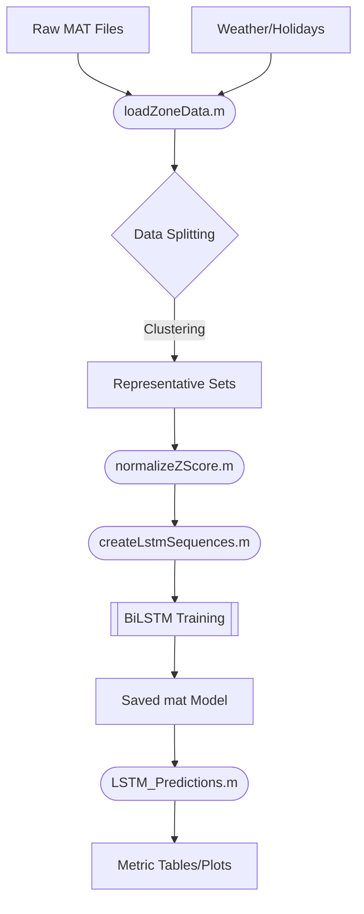

# Project Overview

This project implements a sophisticated energy consumption prediction system for Vehicle-to-Grid (V2G) applications using MATLAB. It leverages **Long Short-Term Memory (LSTM)** neural networks and **Regression Learner** models to forecast electricity demand across different urban zones (e.g., Anagnina, Trieste).

## Key Features
- **Multi-Zone Forecasting**: Trained on specific zones with the capability to generalize across different geographical areas.
- **Multivariate Input**: Integrates historical consumption (autoregressive), weather data (temperature, wind, precipitation), and calendar information (holidays).
- **Cyclical Time Encoding**: Uses Sine/Cosine transformations for Hours and Days of the Week to help the LSTM understand temporal periodicity.
- **Automated Day Selection**: Implements a clustering algorithm to select representative typical days and Sundays for fair evaluation.
- **Advanced Diagnostics**: Comprehensive residual analysis, including Autocorrelation (ACF) and Q-Q plots, and automated performance reporting.

## Target Audience
- **Data Scientists/ML Engineers**: Looking to understand time-series forecasting implementations in MATLAB.
- **V2G Researchers**: Interested in energy demand modeling for grid-vehicle interactions.

# User Experience

## Example Usage
To train a new model for a specific zone:
1. Open [LSTM.m](./LSTM.m).
2. Set the `zoneId` (e.g., `zoneId = 8`).
3. Run the script. The training progress window will appear, and the model will be saved in the `Sessioni/` folder once complete.

To evaluate cross-zone performance:
1. Open [LSTM_Predictions.m](./LSTM_Predictions.m).
2. Configure `targetZones` (e.g., `[8, 9, 10, 11]`).
3. Run the script to see how the most recent model performs on other zones.

## Function and Class Documentation
| Function | Purpose |
| :--- | :--- |
| [loadZoneData.m](./Scripts/loadZoneData.m) | Merges zone energy data with shared weather and holiday datasets. |
| [createLstmSequences.m](./Scripts/createLstmSequences.m) | Converts tabular data into 3D windows (sequences) required for LSTM training. |
| [selectRepresentativeDays.m](./Scripts/selectRepresentativeDays.m) | Clusters data to extract "normal" and "weekend" days for validation/test sets. |
| [normalizeZScore.m](./Scripts/normalizeZScore.m) | Standardizes data using training set distribution to prevent leakage. |
| [plotResults.m](./Scripts/plotResults.m) | Generates time-series visualizations with super-imposed real vs predicted lines. |

## User Interaction Flow
1. **Configure Environment**: Set paths and parameters in `LSTM.m`.
2. **Train**: The script handles data loading, preprocessing, and model training via `trainnet`.
3. **Analyze**: Review automated summaries in the Command Window and generated figure plots.
4. **Save**: Models are automatically archived with timestamps and associated metadata.

# Technical Overview

## Dependencies & Setup
- **MATLAB Release**: R2023b or later (recommended for `trainnet` support).
- **Deep Learning Toolbox**: Required for LSTM layers and training functions.
- **Statistics and Machine Learning Toolbox**: Required for Regression Learner and metrics.
- **Data**: Folder `Dati Estratti (from Condivisione)` and `Gabriele Datas` must be present.

## Development Guide
- **Setup**: Simply add the `Scripts/` folder to your path (automated in main scripts).
- **Workflow**: Modify architecture in [LSTM.m:144-152](./LSTM.m#L144-152) to experiment with hidden units or layers.
- **Testing**: Use `LSTM_Predictions.m` to verify model stability across different data distributions.

### Areas for Improvement
- **Feature Engineering**: Incremental testing of lagged weather features beyond strictly current-step weather.
- **Hyperparameter Optimization**: Use Bayesian Optimization for `MiniBatchSize` and `InitialLearnRate`.
- **Deployment**: Consider generating a Standalone Application using MATLAB Compiler.

### Potential Bugs
- **Memory**: Very large sequence lengths (high `numLags`) can lead to high RAM usage during training.
- **Missing Data**: While `createLstmSequences.m` filters for consecutive days, large gaps in raw MAT files can reduce available training sequences.

# System Architecture

## High-Level Pipeline

## Data Flow
1. **Extraction**: `loadZoneData.m` uses a switch-case to pull specific zone energy columns.
2. **Transformation**: Cyclical time features (cos/sin) are computed in the main script.
3. **Sequencing**: A sliding window of size `numLags` (default 48 = 24h) creates the `[Samples x Lags x Features]` input.
4. **Mapping**: The target is always `y(t+1)` where the sequence ends at `t`.

This documentation was generated by AI.
